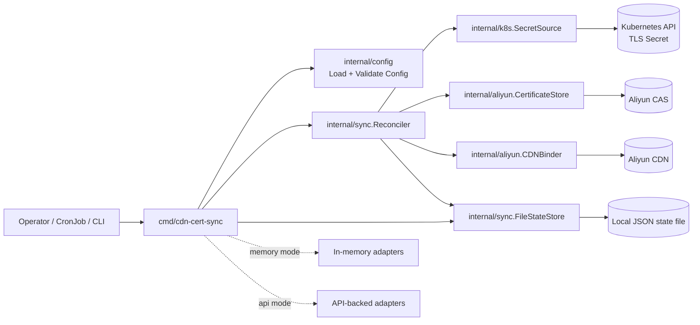

# Architecture

## Overview

`aliyun-cdn-cert-sync` synchronizes a TLS certificate managed in Kubernetes with Aliyun Certificate Management Service (CAS), then updates one or more Aliyun CDN domains to use that certificate.

The application is intentionally small and organized around a single reconcile workflow:

1. Load and validate runtime configuration.
2. Read a target Kubernetes TLS Secret.
3. Derive the certificate fingerprint from `tls.crt`.
4. Reuse an existing Aliyun CAS certificate when the fingerprint is already known.
5. Upload a new certificate to CAS when no matching certificate exists.
6. Bind the resulting certificate ID to all configured CDN domains.
7. Persist fingerprint-to-certificate mapping in a local state file to reduce repeated lookups.

The binary supports two adapter modes:

- `memory`: in-memory adapters for local development and tests.
- `api`: real Kubernetes and Aliyun API integrations for production use.

## Goals

- Keep cloud-provider-specific behavior isolated in `internal/aliyun`.
- Keep orchestration logic centralized in `internal/sync`.
- Support safe repeated execution through fingerprint-based idempotency.
- Allow the same reconcile workflow to run against fake adapters or live APIs.

## High-Level Architecture

## Component Responsibilities

### `cmd/cdn-cert-sync`

The entrypoint is responsible for:

- Parsing CLI flags such as `--config`, `--adapter-mode`, `--in-cluster`, and `--kubeconfig`.
- Loading configuration from YAML and environment overrides.
- Validating configuration before any external operation starts.
- Constructing the adapter set based on the selected mode.
- Creating the reconcile state store.
- Executing a single `RunOnce` reconciliation with a timeout-bound context.

This package should stay thin. It wires dependencies together but should not contain business rules for certificate synchronization.

### `internal/config`

This package owns runtime configuration:

- YAML parsing.
- Environment variable overrides.
- Validation rules for runtime mode, Kubernetes settings, Aliyun settings, retry policy, and state file path.

Its role is to fail fast before the sync workflow begins. In `api` mode, it additionally enforces that required Aliyun endpoints and credentials are present.

### `internal/k8s`

This package abstracts certificate retrieval from Kubernetes behind `SecretSource`.

Key responsibilities:

- Read the target TLS Secret.
- Return a normalized `TLSSecret` value containing namespace, name, certificate PEM, and key PEM.
- Compute the X.509 certificate fingerprint from `tls.crt`.
- Provide both memory and API-backed implementations.

The reconcile layer depends only on the `SecretSource` interface, not on Kubernetes client details.

### `internal/aliyun`

This package contains all Aliyun-facing logic and abstractions.

It is split conceptually into two interfaces:

- `CertificateStore`: find a CAS certificate by fingerprint and create a new certificate when needed.
- `CDNBinder`: update a CDN domain to use a certificate ID.

Key responsibilities:

- Map internal operations to Aliyun CAS and CDN API calls.
- Keep Aliyun request and response handling outside the reconcile package.
- Provide memory implementations for tests and local development.

This separation makes it possible to test reconcile behavior without live cloud dependencies.

### `internal/sync`

This package is the orchestration layer and the core of the system.

Key responsibilities:

- Execute the end-to-end synchronization flow.
- Apply retry logic around external operations.
- Coordinate lookup, upload, and CDN binding.
- Track operational results in a `Report`.
- Persist and reuse fingerprint-to-certificate mappings via `StateStore`.

The `Reconciler` is intentionally unaware of SDK details. It works with narrow interfaces and focuses on workflow decisions.

### State Store

The default state store is `FileStateStore`, which persists a JSON document on local disk.

Purpose:

- Cache `fingerprint -> certificate ID` mappings.
- Avoid unnecessary CAS queries after a certificate has already been resolved.
- Preserve idempotent behavior across repeated runs of a CronJob or CLI invocation.

This state is an optimization layer, not the system of record. Aliyun CAS remains the authoritative source for uploaded certificates.

## Runtime Modes

### Memory Mode

`memory` mode is intended for:

- local development,
- basic smoke testing,
- isolated unit-test-friendly execution.

In this mode:

- Kubernetes reads come from an in-memory secret source,
- certificate storage is in memory,
- CDN bindings are stored in memory,
- no external API calls are made.

### API Mode

`api` mode is intended for real environments.

In this mode:

- Kubernetes secrets are fetched through the Kubernetes API,
- certificate lookup and upload are executed against Aliyun CAS,
- domain binding updates are executed against Aliyun CDN,
- credentials and endpoints come from config plus environment overrides.

This mode is the production execution path and is typically used by a Kubernetes `CronJob`.

## Reconcile Flow

The `Reconciler.RunOnce` workflow follows this order:

1. Read the configured Kubernetes TLS Secret with retry support.
2. Compute the certificate fingerprint from the PEM certificate.
3. Check the state store for a previously known CAS certificate ID.
4. If not cached, search Aliyun CAS by fingerprint.
5. If CAS does not contain the certificate, upload the certificate and private key.
6. Store the resolved certificate ID in the state file.
7. Iterate through every configured CDN domain and bind the certificate ID.
8. Count successful domain updates, failed domain updates, and retries in the final report.

Important behavior:

- Secret reads and Aliyun operations are retryable.
- CDN domain updates are attempted independently per domain.
- A domain binding failure increases `DomainFailures` but does not discard successful updates to other domains.
- The current implementation executes bindings sequentially rather than in parallel.

## Idempotency Model

Idempotency is based on the certificate fingerprint derived from `tls.crt`.

The workflow tries to avoid duplicate uploads through two layers:

- a local state file cache,
- a remote CAS lookup by fingerprint.

This means repeated runs with the same certificate typically result in:

- no new CAS upload,
- reuse of the existing certificate ID,
- reapplication of CDN bindings if needed.

## Error Handling and Retries

The sync logic applies retry behavior to unstable external operations using the configured retry policy:

- `sync.maxRetries`
- `sync.retryBaseMillis`

Operational implications:

- transient Kubernetes API failures can be retried,
- transient Aliyun lookup, upload, and bind failures can be retried,
- the final `Report` includes the accumulated retry count.

The process is still single-shot per invocation. Scheduling, repeated execution, and backoff across runs are delegated to the caller, typically Kubernetes CronJob scheduling.

## Deployment View

The expected production deployment is:

- a Kubernetes `CronJob` running the binary,
- RBAC that grants read access to the target TLS Secret,
- a ConfigMap for non-secret configuration,
- a Secret for Aliyun credentials,
- a writable filesystem path for the state JSON file.

The deployment manifests under `deploy/` reflect this operational model.

## Security Considerations

The design keeps certificate material scoped to the minimum required path:

- read TLS material from a single Kubernetes Secret,
- send certificate and key only to Aliyun CAS when upload is needed,
- bind CDN domains using the CAS certificate ID rather than raw PEM material.

Operational guidance:

- use least-privilege RAM permissions,
- avoid logging certificate PEM, private keys, or sensitive subject details,
- protect the state file because it contains infrastructure mapping metadata,
- prefer Kubernetes Secrets or environment injection for Aliyun credentials.

## Scalability and Limitations

Current design characteristics:

- one source Secret per process invocation,
- one CAS certificate resolution per run,
- sequential CDN domain binding,
- file-based local state,
- no leader election or distributed coordination.

This is a good fit for small to medium domain sets and scheduled reconciliation. If the project later needs to manage many Secrets, many tenants, or higher update throughput, the likely next steps would be:

- multi-resource reconciliation,
- parallel domain binding with bounded concurrency,
- richer structured logging and metrics,
- a more durable shared state backend if local filesystem state becomes insufficient.

## Directory-to-Architecture Mapping

- `cmd/cdn-cert-sync/`: application entrypoint and dependency wiring.
- `internal/config/`: config loading, env override, and validation.
- `internal/k8s/`: Kubernetes Secret access and certificate fingerprint extraction.
- `internal/aliyun/`: CAS and CDN integrations plus provider-specific abstractions.
- `internal/sync/`: reconcile workflow, retry handling, report generation, and state persistence.
- `configs/`: example configuration files.
- `deploy/`: Kubernetes deployment manifests.
- `docs/`: operational and architecture documentation.

## Summary

The architecture is intentionally interface-driven and workflow-centric. The `Reconciler` contains the certificate synchronization logic, while Kubernetes access, Aliyun integrations, configuration loading, and state persistence are kept in separate packages.

That separation gives the project three useful properties:

- production behavior can use live APIs without changing business logic,
- local development and tests can run with in-memory adapters,
- repeated execution remains safe through fingerprint-based certificate reuse.
