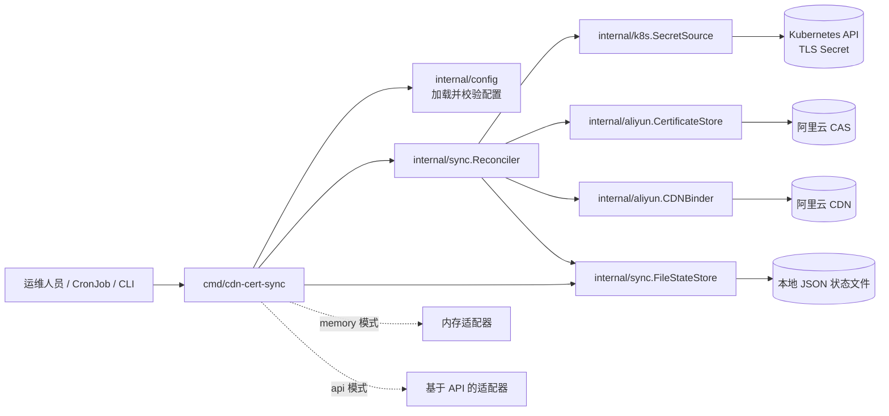

# 架构文档

## 概览

`aliyun-cdn-cert-sync` 用于将 Kubernetes 中维护的 TLS 证书同步到阿里云证书管理服务（CAS），然后把该证书更新绑定到一个或多个阿里云 CDN 域名。

应用整体保持轻量，围绕单次协调流程组织：

1. 加载并校验运行时配置。
2. 读取目标 Kubernetes TLS Secret。
3. 从 `tls.crt` 计算证书指纹。
4. 当指纹已知时复用阿里云 CAS 中已有证书。
5. 当不存在匹配证书时向 CAS 上传新证书。
6. 将得到的证书 ID 绑定到所有配置的 CDN 域名。
7. 将“证书指纹到证书 ID”的映射持久化到本地状态文件，以减少重复查询。

二进制支持两种适配器模式：

- `memory`：用于本地开发和测试的内存适配器。
- `api`：用于生产环境的真实 Kubernetes 与阿里云 API 集成。

## 设计目标

- 将云厂商相关行为隔离在 `internal/aliyun` 中。
- 将编排逻辑集中放在 `internal/sync` 中。
- 通过基于证书指纹的幂等机制支持安全重复执行。
- 让同一套协调流程既能跑在假实现上，也能跑在真实 API 上。

## 高层架构

## 组件职责

### `cmd/cdn-cert-sync`

入口程序负责：

- 解析 `--config`、`--adapter-mode`、`--in-cluster`、`--kubeconfig` 等 CLI 参数。
- 从 YAML 和环境变量覆盖中加载配置。
- 在进行任何外部操作前先校验配置。
- 根据所选模式构造适配器集合。
- 创建协调流程使用的状态存储。
- 在带超时的上下文中执行一次 `RunOnce` 协调。

这个包应保持轻量，只负责装配依赖，不承载证书同步的业务规则。

### `internal/config`

该包负责运行时配置：

- YAML 解析。
- 环境变量覆盖。
- 对运行模式、Kubernetes 配置、阿里云配置、重试策略和状态文件路径进行校验。

它的职责是在同步流程启动前尽早失败。在 `api` 模式下，还会额外确保阿里云所需的 endpoint 和凭证已经提供。

### `internal/k8s`

该包通过 `SecretSource` 抽象 Kubernetes 中的证书读取能力。

关键职责：

- 读取目标 TLS Secret。
- 返回标准化的 `TLSSecret` 值，其中包含 namespace、name、证书 PEM 和私钥 PEM。
- 从 `tls.crt` 中计算 X.509 证书指纹。
- 提供内存版和 API 版两种实现。

协调层只依赖 `SecretSource` 接口，而不依赖 Kubernetes 客户端细节。

### `internal/aliyun`

该包包含所有面向阿里云的逻辑和抽象。

概念上分为两个接口：

- `CertificateStore`：按指纹查找 CAS 证书，并在需要时创建新证书。
- `CDNBinder`：更新 CDN 域名所使用的证书 ID。

关键职责：

- 把内部操作映射为阿里云 CAS 和 CDN API 调用。
- 将阿里云请求与响应处理隔离在协调包之外。
- 为测试和本地开发提供内存实现。

这种拆分使得协调逻辑可以在不依赖真实云环境的情况下完成测试。

### `internal/sync`

该包是编排层，也是整个系统的核心。

关键职责：

- 执行端到端证书同步流程。
- 为外部操作施加重试逻辑。
- 协调查找、上传和 CDN 绑定。
- 用 `Report` 记录本次执行结果。
- 通过 `StateStore` 持久化并复用“指纹到证书 ID”的映射。

`Reconciler` 有意不感知底层 SDK 细节。它只依赖窄接口，并专注于流程决策。

### 状态存储

默认状态存储是 `FileStateStore`，会在本地磁盘上持久化一个 JSON 文档。

作用：

- 缓存 `fingerprint -> certificate ID` 映射。
- 在证书已经解析过后避免不必要的 CAS 查询。
- 让 CronJob 或 CLI 多次运行时仍保持幂等行为。

这份状态属于优化层，而不是系统事实来源。阿里云 CAS 仍然是已上传证书的权威来源。

## 运行模式

### Memory 模式

`memory` 模式适用于：

- 本地开发，
- 基础冒烟测试，
- 易于单元测试的隔离执行。

在这个模式下：

- Kubernetes 读取来自内存中的 Secret 源，
- 证书存储位于内存中，
- CDN 绑定结果位于内存中，
- 不会发生任何外部 API 调用。

### API 模式

`api` 模式用于真实环境。

在这个模式下：

- Kubernetes Secret 通过 Kubernetes API 获取，
- 证书查询与上传通过阿里云 CAS 执行，
- 域名绑定更新通过阿里云 CDN 执行，
- 凭证和 endpoint 来自配置及环境变量覆盖。

这是生产环境执行路径，通常由 Kubernetes `CronJob` 驱动。

## 协调流程

`Reconciler.RunOnce` 的执行顺序如下：

1. 通过带重试的方式读取配置指定的 Kubernetes TLS Secret。
2. 从 PEM 证书计算证书指纹。
3. 在状态存储中查询是否已有已知 CAS 证书 ID。
4. 若本地未命中，则按指纹查询阿里云 CAS。
5. 若 CAS 中不存在该证书，则上传证书和私钥。
6. 将最终解析出的证书 ID 写入状态文件。
7. 遍历所有配置的 CDN 域名并绑定该证书 ID。
8. 在最终报告中统计成功更新域名数、失败域名数和重试次数。

需要注意的行为：

- Secret 读取和阿里云操作都支持重试。
- 每个 CDN 域名的更新会独立尝试。
- 某个域名绑定失败会增加 `DomainFailures`，但不会回滚其他已成功域名的更新结果。
- 当前实现按顺序执行域名绑定，而不是并行执行。

## 幂等性模型

幂等性基于从 `tls.crt` 计算得到的证书指纹。

流程通过两层机制避免重复上传：

- 本地状态文件缓存，
- 远端 CAS 按指纹查询。

这意味着当同一张证书重复执行时，通常会得到以下结果：

- 不会产生新的 CAS 上传，
- 复用已有证书 ID，
- 必要时重新应用 CDN 绑定。

## 错误处理与重试

同步逻辑会根据配置的重试策略，对不稳定的外部操作进行重试：

- `sync.maxRetries`
- `sync.retryBaseMillis`

其运行含义是：

- Kubernetes API 的瞬时失败可以重试，
- 阿里云查询、上传和绑定的瞬时失败可以重试，
- 最终 `Report` 会包含累计的重试次数。

整个进程仍然是“每次调用只执行一次”的单次运行模型。调度、重复执行以及跨运行间隔的退避由调用方负责，通常是 Kubernetes CronJob 的调度能力。

## 部署视图

预期的生产部署形式是：

- 一个运行该二进制的 Kubernetes `CronJob`，
- 具备目标 TLS Secret 读取权限的 RBAC，
- 用于非敏感配置的 ConfigMap，
- 用于阿里云凭证的 Secret，
- 一个可写的状态 JSON 文件路径。

`deploy/` 目录下的清单文件体现的就是这一运行模型。

## 安全性考虑

该设计将证书材料限制在最小必要路径内：

- 从单个 Kubernetes Secret 读取 TLS 材料，
- 仅在需要上传时才把证书和私钥发送到阿里云 CAS，
- CDN 绑定阶段使用 CAS 证书 ID，而不是直接使用 PEM 内容。

运行建议：

- 使用最小权限 RAM 策略，
- 避免记录证书 PEM、私钥或敏感主题信息，
- 保护状态文件，因为其中包含基础设施映射元数据，
- 阿里云凭证优先通过 Kubernetes Secret 或环境变量注入。

## 可扩展性与限制

当前设计特征包括：

- 每次进程执行只处理一个源 Secret，
- 每次运行只解析一张 CAS 证书，
- CDN 域名绑定按顺序执行，
- 使用基于文件的本地状态，
- 没有 leader election 或分布式协调。

这一设计非常适合小到中等规模域名集合的定时协调任务。如果后续需要管理更多 Secret、更多租户或更高吞吐，比较自然的演进方向包括：

- 支持多资源协调，
- 用有界并发实现并行域名绑定，
- 增强结构化日志和指标，
- 当本地文件状态不足时，引入更持久的共享状态后端。

## 目录与架构映射

- `cmd/cdn-cert-sync/`：应用入口和依赖装配。
- `internal/config/`：配置加载、环境变量覆盖与校验。
- `internal/k8s/`：Kubernetes Secret 访问与证书指纹提取。
- `internal/aliyun/`：CAS/CDN 集成以及云厂商相关抽象。
- `internal/sync/`：协调流程、重试处理、报告生成与状态持久化。
- `configs/`：示例配置文件。
- `deploy/`：Kubernetes 部署清单。
- `docs/`：运行与架构文档。

## 总结

该架构刻意采用“接口驱动 + 流程中心”的设计。`Reconciler` 承载证书同步核心逻辑，而 Kubernetes 访问、阿里云集成、配置加载和状态持久化分别放在独立包中。

这种拆分带来三个直接收益：

- 生产环境可以使用真实 API，而不必修改业务逻辑，
- 本地开发和测试可以运行在内存适配器之上，
- 通过基于指纹的证书复用机制，重复执行仍然保持安全。
